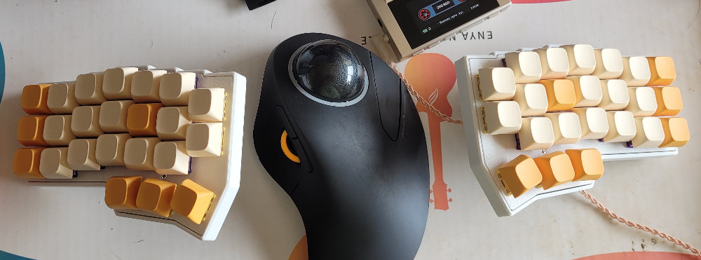
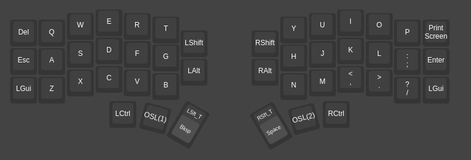
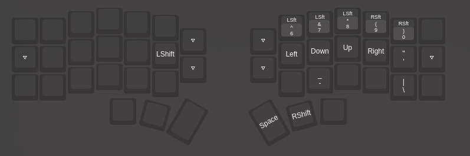
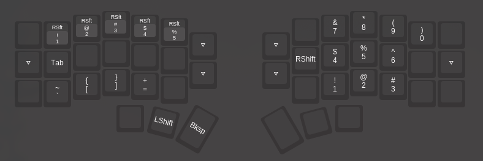

# FCZ keyboard layout 2026

Used on a Corne split-keyboard.





## Letters

QWERTY


## Actions

- **Space**: right thumb 1
  - **Right Shift**: hold right thumb 1
- **Backspace**: left thumb 1
  - **Left Shift**: hold left thumb 1
- **Enter**: left thumb 2 (switch to layer 1), followed by right thumb 1
  - or right pinky, home row, last column (if 3x6 corne)
- **Esc**: right thumb 2 (switch to layer 2), followed by left thumb 1
  - or left pink, home row, first column (if 3x6 corne)

- **Tab**: left pinky on **layer 2**


## Vial

[Download .vil config](./fcz-keyboard-layout-2006.vil) file.

### layer 0




### layer 1




### layer 2




​                    

## Layer Switching

Center key on the thumb-clusters, also referred here as thumb-key-2 on each side are layer modifier keys, left side changes to layer 1 for the next key (OSL) or while holding, right side changes to layer 2.


## Arrow keys

Arrow keys are same as Vim navigatio; `H J K L`, but with **layer 1** turned on.


## Numbers

Layer 2 has numbers on the right hand distributed as a numpad, but with 0 right after 9.


## Symbols

**Layer 2** has the symbols: `! @ # $ %` on top row of left side, and **Layer 1** has the symbols `^ & * ( )` on top row of the right side. Similar to the positions in a laptop keyboard with a number row.

The remaining symbols are as follows:


### layer1

```
- and \ as bottom row positions 2 and 5 of the right side.
_ and | can be typed using a special shift key of layer 1 (position of the G key on layer 0)
```


### layer 2

```
` [ ] and = as bottom row positions 5 4 3 2 of the left side.
~ { } and + can be typed using a special shift key of layer 2 (position of the H key on layer 0)
```


## Center Cluster (corne v4)

Bottom row are Left Alt and Right Alt (compose key). Top row are Left Shift and Right Shift.


## External Columns

As already mentioned, If your corne is 3x6, Esc and Enter are on middle row, with Left Super on both sides in the bottom row and with Del and Printscr on the top row.


-----


## Usage-based feedback

- Super key position is not the most comfortable… maybe rethink it considering that hyprland default keybinds for Omarchy uses Super a lot. 


## To-do

- Ctrl PgUp, Ctrl PgDown keys for tab-switching
- Media Volume Up/Down
- Fn keys
